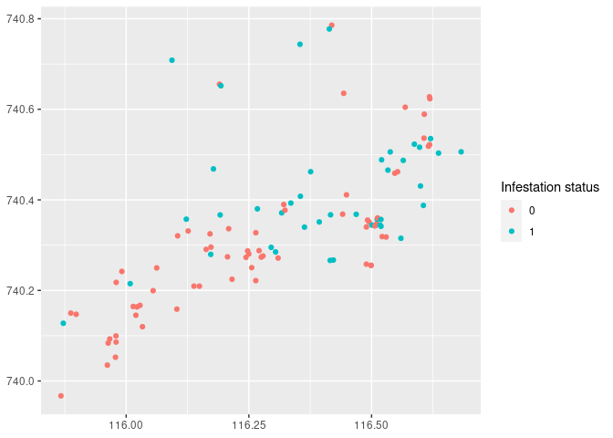
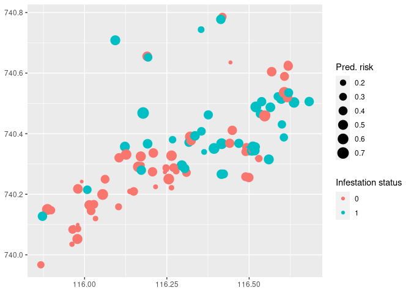
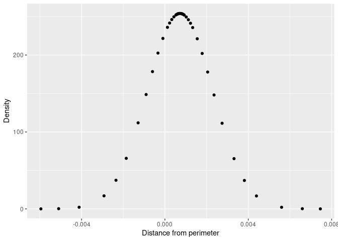
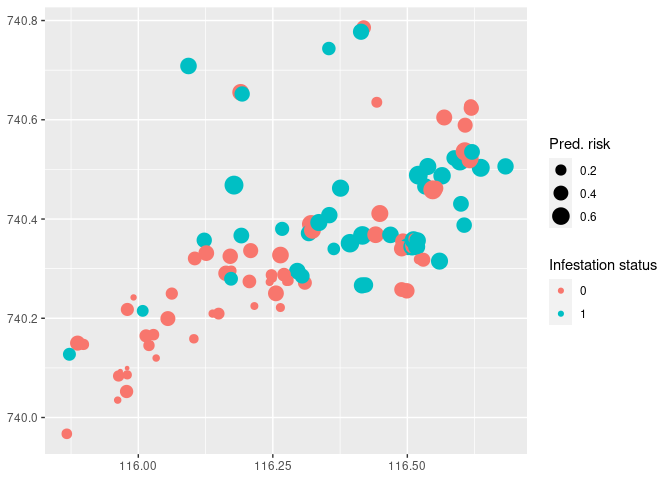

[](https://zenodo.org/badge/latestdoi/275468173)

This repository contains the code and data necessary for reproducing the results in the paper 
[Spatial epidemiology and adaptive targeted sampling to manage the Chagas disease vector Triatoma dimidiata](https://arxiv.org/abs/2111.05964),
by B. K. M. Case et al.

## Spatial modeling with INLA

Here we provide a short tutorial on fitting the types of spatial models
used throughout the paper using the R-INLA package. INLA (Integrated
Nested Laplacian Approximation) is an alternative to MCMC for fitting a
wide variety of Bayesian models, and has become a popular option for
geospatial models because of its speed and relative ease of use (see
[Bakka et
al. (2018)](https://wires.onlinelibrary.wiley.com/doi/pdf/10.1002/wics.1443)
for a recent review).

### Load required packages and the data

``` r
library(INLA)
library(tidyverse)
source("code/seq-sampling-helpers.R")


all <- read_csv("anon-survey-data.csv")
pat <- filter(all, village == "Paternito")
```

### Patterns of infestation

We are going to fit a spatial model to the infestation data in El
Paternito. To begin exploring this data, we can produce a plot of the
binary infestation status of each home. Note that the latitude and
longitude are not actual coordinates here as they have been anonimized,
but we can still treat them as x and y coordinates, respectively.

``` r
ggplot(pat, aes(long, lat, col = as.factor(infestation))) +
    geom_point() +
    labs(x = NULL, y = NULL, col = 'Infestation status')
```

<!-- -->

We find that infested houses tend to be in middle and upper parts of the
village, and often can be found close to other infested houses.

### Traditional logistic regression

Before incorporating spatial effects, let’s fit a model using only fixed
effects from the covariate information.  
For simplicity, let’s only use the covariates `bed_hygiene`, `num_dogs`,
and `dist_perim`. To fit such a model in R-INLA, we use the `inla`
function:

``` r
fit_fx_only <- inla(infestation ~ bed_hygiene + num_dogs + dist_perim, data = pat, family = 'binomial')
summary(fit_fx_only)
```

    ## 
    ## Call:
    ##    c("inla.core(formula = formula, family = family, contrasts = contrasts, 
    ##    ", " data = data, quantiles = quantiles, E = E, offset = offset, ", " 
    ##    scale = scale, weights = weights, Ntrials = Ntrials, strata = strata, 
    ##    ", " lp.scale = lp.scale, link.covariates = link.covariates, verbose = 
    ##    verbose, ", " lincomb = lincomb, selection = selection, control.compute 
    ##    = control.compute, ", " control.predictor = control.predictor, 
    ##    control.family = control.family, ", " control.inla = control.inla, 
    ##    control.fixed = control.fixed, ", " control.mode = control.mode, 
    ##    control.expert = control.expert, ", " control.hazard = control.hazard, 
    ##    control.lincomb = control.lincomb, ", " control.update = 
    ##    control.update, control.lp.scale = control.lp.scale, ", " 
    ##    control.pardiso = control.pardiso, only.hyperparam = only.hyperparam, 
    ##    ", " inla.call = inla.call, inla.arg = inla.arg, num.threads = 
    ##    num.threads, ", " blas.num.threads = blas.num.threads, keep = keep, 
    ##    working.directory = working.directory, ", " silent = silent, inla.mode 
    ##    = inla.mode, safe = FALSE, debug = debug, ", " .parent.frame = 
    ##    .parent.frame)") 
    ## Time used:
    ##     Pre = 0.876, Running = 0.357, Post = 0.0698, Total = 1.3 
    ## Fixed effects:
    ##                   mean    sd 0.025quant 0.5quant 0.975quant mode   kld
    ## (Intercept)     -2.356 0.721     -3.853   -2.329     -1.023   NA 0.004
    ## bed_hygienemala  1.624 0.566      0.586    1.600      2.806   NA 0.003
    ## num_dogs         0.238 0.132     -0.015    0.236      0.502   NA 0.001
    ## dist_perim       0.001 0.002     -0.002    0.001      0.004   NA 0.000
    ## 
    ## Marginal log-Likelihood:  -85.51 
    ##  is computed 
    ## Posterior summaries for the linear predictor and the fitted values are computed
    ## (Posterior marginals needs also 'control.compute=list(return.marginals.predictor=TRUE)')

You may notice the syntax is quite similar to base R’s `lm` and `glm`
functions: first we provide a formula with names corresponding to the
data specified with `data = pat`, then we specify a binomial response to
indicate our data are binary. Notice also that, just like base R, INLA
will automatically convert discrete variables into dummy variables in
the model matrix.

This is all it takes to perform fully Bayesian inference using INLA\!
Note that here we have used the default priors for the fixed effect
coefficients.

#### Summary statistics and marginal distributions

In addition to viewing some summary statistics of the posterior with the
`summary` function, this information is contained as fields in the INLA
fit object:

``` r
fit_fx_only$summary.fixed$`0.5quant` # median of fixed effects coefficients
```

    ## [1] -2.3292292301  1.6004537289  0.2357212496  0.0007266076

``` r
head(fit_fx_only$summary.linear.predictor) # "untransformed" risk of infestation
```

    ##                      mean        sd 0.025quant    0.5quant  0.975quant mode
    ## Predictor.001 -0.53847169 0.3200719 -1.1766221 -0.53484055  0.07903589   NA
    ## Predictor.002 -0.10564066 0.2454496 -0.5878965 -0.10531791  0.37478805   NA
    ## Predictor.003 -2.19537562 0.6116982 -3.4833698 -2.16418881 -1.08088199   NA
    ## Predictor.004 -0.47841247 0.3591345 -1.1912958 -0.47541956  0.21746104   NA
    ## Predictor.005  0.02771544 0.3217125 -0.6027244  0.02755401  0.65906825   NA
    ## Predictor.006 -0.11116868 0.5002281 -1.0965332 -0.10962867  0.86546188   NA
    ##                        kld
    ## Predictor.001 5.630364e-04
    ## Predictor.002 7.912682e-06
    ## Predictor.003 3.066387e-03
    ## Predictor.004 3.892862e-04
    ## Predictor.005 7.034523e-05
    ## Predictor.006 8.029855e-06

``` r
head(fit_fx_only$summary.fitted.values) # transformed risk (between 0 and 1)
```

    ##                           mean         sd 0.025quant  0.5quant 0.975quant mode
    ## fitted.Predictor.001 0.3715673 0.07296387 0.23566009 0.3693886  0.5197487   NA
    ## fitted.Predictor.002 0.4740009 0.06030864 0.35711765 0.4736948  0.5926154   NA
    ## fitted.Predictor.003 0.1130782 0.05834301 0.02978913 0.1030128  0.2533391   NA
    ## fitted.Predictor.004 0.3860366 0.08265158 0.23302727 0.3833343  0.5541520   NA
    ## fitted.Predictor.005 0.5067562 0.07845027 0.35372065 0.5068881  0.6590511   NA
    ## fitted.Predictor.006 0.4738190 0.11786793 0.25039003 0.4726202  0.7038005   NA

Notice the distinction between `linear.predictor`, the logit transformed
risk, and `fitted.values`, which is the actual risk of infestation. Now
we plot the expected risk of each home compared to its true infestation
status:

``` r
pat |>
    mutate(pred_risk = fit_fx_only$summary.fitted.values$mean) |>
    ggplot(aes(long, lat, col = as.factor(infestation), size = pred_risk)) +
    geom_point() +
    labs(x = NULL, y = NULL, col = 'Infestation status', size = "Pred. risk")
```

<!-- -->

Marginal distributions for the coefficients can be accessed similarly,
which can then be converted into density functions, sampled from, etc.

``` r
marg <- fit_fx_only$marginals.fixed$dist_perim
qplot(marg[,1], marg[,2], xlab = "Distance from perimeter", ylab = "Density")
```

<!-- -->

The posterior probability that `dist_perim` has a positive association
with the response can be computed like this:

``` r
1 - inla.pmarginal(0, marg)
```

    ## [1] 0.6775502

A number of other functions for working with marginal distributions are
available.

### Adding random effects in R-INLA

Adding random effects to your hierarchical model is easy and where the
INLA approach really starts to shine. The following models are
supported:

``` r
names(inla.models()$latent)
```

    ##  [1] "linear"       "iid"          "mec"          "meb"          "rgeneric"    
    ##  [6] "cgeneric"     "rw1"          "rw2"          "crw2"         "seasonal"    
    ## [11] "besag"        "besag2"       "bym"          "bym2"         "besagproper" 
    ## [16] "besagproper2" "fgn"          "fgn2"         "ar1"          "ar1c"        
    ## [21] "ar"           "ou"           "intslope"     "generic"      "generic0"    
    ## [26] "generic1"     "generic2"     "generic3"     "spde"         "spde2"       
    ## [31] "spde3"        "iid1d"        "iid2d"        "iid3d"        "iid4d"       
    ## [36] "iid5d"        "iidkd"        "2diid"        "z"            "rw2d"        
    ## [41] "rw2diid"      "slm"          "matern2d"     "dmatern"      "copy"        
    ## [46] "clinear"      "sigm"         "revsigm"      "log1exp"      "logdist"

Documentation and examples on each of these models can be found using
`inla.doc("<model name>")`.

Random effects are included with the `f` function in the model formula.
This function takes an index variable as its first argument, which is
used to assign observations to groups. For example, to include `village`
as a random effect when using the data from all villages, simply use
this variable as the index variable:

``` r
base_f <- infestation ~ bed_hygiene + num_dogs + dist_perim
fit_vil <- inla(update(base_f, ~. + f(village, model = "iid")), data = all, family = "binomial")
summary(fit_vil)
```

    ## 
    ## Call:
    ##    c("inla.core(formula = formula, family = family, contrasts = contrasts, 
    ##    ", " data = data, quantiles = quantiles, E = E, offset = offset, ", " 
    ##    scale = scale, weights = weights, Ntrials = Ntrials, strata = strata, 
    ##    ", " lp.scale = lp.scale, link.covariates = link.covariates, verbose = 
    ##    verbose, ", " lincomb = lincomb, selection = selection, control.compute 
    ##    = control.compute, ", " control.predictor = control.predictor, 
    ##    control.family = control.family, ", " control.inla = control.inla, 
    ##    control.fixed = control.fixed, ", " control.mode = control.mode, 
    ##    control.expert = control.expert, ", " control.hazard = control.hazard, 
    ##    control.lincomb = control.lincomb, ", " control.update = 
    ##    control.update, control.lp.scale = control.lp.scale, ", " 
    ##    control.pardiso = control.pardiso, only.hyperparam = only.hyperparam, 
    ##    ", " inla.call = inla.call, inla.arg = inla.arg, num.threads = 
    ##    num.threads, ", " blas.num.threads = blas.num.threads, keep = keep, 
    ##    working.directory = working.directory, ", " silent = silent, inla.mode 
    ##    = inla.mode, safe = FALSE, debug = debug, ", " .parent.frame = 
    ##    .parent.frame)") 
    ## Time used:
    ##     Pre = 0.516, Running = 0.417, Post = 0.0809, Total = 1.01 
    ## Fixed effects:
    ##                   mean    sd 0.025quant 0.5quant 0.975quant mode kld
    ## (Intercept)     -1.162 0.243     -1.617   -1.172     -0.656   NA   0
    ## bed_hygienemala  0.716 0.158      0.408    0.715      1.028   NA   0
    ## num_dogs        -0.017 0.045     -0.107   -0.017      0.070   NA   0
    ## dist_perim       0.000 0.000     -0.001    0.000      0.001   NA   0
    ## 
    ## Random effects:
    ##   Name     Model
    ##     village IID model
    ## 
    ## Model hyperparameters:
    ##                          mean       sd 0.025quant 0.5quant 0.975quant mode
    ## Precision for village 6098.23 13661.57       1.89    17.26   50735.09   NA
    ## 
    ## Marginal log-Likelihood:  -565.14 
    ##  is computed 
    ## Posterior summaries for the linear predictor and the fitted values are computed
    ## (Posterior marginals needs also 'control.compute=list(return.marginals.predictor=TRUE)')

There is now a new section in the model summary: the *hyperparameters*.
In INLA these are defined as any unknown variables that the random
effects depend on. Notice the precision (inverse variance) of our random
effect itself has an enormous variance. This is because the default
prior for the precision is quite diffuse. While this is an appropriate
weakly informative prior when using linear regression, this is far too
diffuse for good shrinkage using logistic regression and our particular
data set. Adjusting these priors is straight forward, but note they are
defined on log scale with the transformation `theta = log(precision)`.

Similarly, let’s adjust the priors on the fixed effect coefficients to
have a more suitable variance for logistic regression.

``` r
hyper_pri_config <- list(theta = list(prior = "loggamma", param = c(1, 0.01)))
fx_pri_config <- list(mean.intercept = 0, prec.intercept = 0.05, mean = 0, prec = 0.05)
fit_vil <- inla(
    update(base_f, ~. + f(village, model = "iid", hyper = hyper_pri_config)), 
    data = all, family = "binomial",
    control.fixed = fx_pri_config
)
summary(fit_vil)
```

    ## 
    ## Call:
    ##    c("inla.core(formula = formula, family = family, contrasts = contrasts, 
    ##    ", " data = data, quantiles = quantiles, E = E, offset = offset, ", " 
    ##    scale = scale, weights = weights, Ntrials = Ntrials, strata = strata, 
    ##    ", " lp.scale = lp.scale, link.covariates = link.covariates, verbose = 
    ##    verbose, ", " lincomb = lincomb, selection = selection, control.compute 
    ##    = control.compute, ", " control.predictor = control.predictor, 
    ##    control.family = control.family, ", " control.inla = control.inla, 
    ##    control.fixed = control.fixed, ", " control.mode = control.mode, 
    ##    control.expert = control.expert, ", " control.hazard = control.hazard, 
    ##    control.lincomb = control.lincomb, ", " control.update = 
    ##    control.update, control.lp.scale = control.lp.scale, ", " 
    ##    control.pardiso = control.pardiso, only.hyperparam = only.hyperparam, 
    ##    ", " inla.call = inla.call, inla.arg = inla.arg, num.threads = 
    ##    num.threads, ", " blas.num.threads = blas.num.threads, keep = keep, 
    ##    working.directory = working.directory, ", " silent = silent, inla.mode 
    ##    = inla.mode, safe = FALSE, debug = debug, ", " .parent.frame = 
    ##    .parent.frame)") 
    ## Time used:
    ##     Pre = 1.23, Running = 0.648, Post = 0.0155, Total = 1.9 
    ## Fixed effects:
    ##                   mean    sd 0.025quant 0.5quant 0.975quant mode kld
    ## (Intercept)     -1.108 0.264     -1.622   -1.111     -0.578   NA   0
    ## bed_hygienemala  0.700 0.158      0.393    0.699      1.011   NA   0
    ## num_dogs        -0.021 0.045     -0.110   -0.020      0.067   NA   0
    ## dist_perim       0.000 0.000     -0.001    0.000      0.001   NA   0
    ## 
    ## Random effects:
    ##   Name     Model
    ##     village IID model
    ## 
    ## Model hyperparameters:
    ##                        mean    sd 0.025quant 0.5quant 0.975quant mode
    ## Precision for village 12.76 16.92       1.51     8.30      51.51   NA
    ## 
    ## Marginal log-Likelihood:  -556.55 
    ##  is computed 
    ## Posterior summaries for the linear predictor and the fitted values are computed
    ## (Posterior marginals needs also 'control.compute=list(return.marginals.predictor=TRUE)')

This fit appears much better, as evident from the higher marginal
likelihood and lower posterior variance on the precision.

### Spatial smoothing with `dmatern`

We now turn to adding spatially correlated random effects. INLA supports
several models suitable for spatial smoothing on regular grids
(e.g. `rw2`), continuous points (e.g. `spde2`), and discrete regions
(e.g. `bym`). Here we use a model for continuous points since our data
are individual points occuring at irregular intervals.

The most popular way to model continuous points in space with INLA is
the SPDE (Stochastic Partial Differential Equation) approach. This
formulation requires more setup, but is much faster than traditional
formulations because it approximates the dense covariance matrix between
points with a sparse matrix.

For brevity, and due to many helpful tutorials on using SPDE with INLA
already being online (several are listed below), we instead focus on a
different formulation available, the `dmatern` model. This model
directly represents the covariance between points and is equivalent to
using SPDE.

Here, the indexing variable `idx` for `f` will need to be a unique
integer for each house, since each house has one observation.
Additionally we will pass a matrix where each row `i` contains the x y
coordinates of the house indexed with `idx = i`.

``` r
idx <- 1:nrow(pat) # indexes rows of location matrix
loc_mat <- as.matrix(select(pat, long, lat)) # matrix of x y coordinates for each point
  
fit_gp_dense <- inla(
    update(base_f, ~. + f(idx, model = "dmatern", locations = loc_mat)),
    data = mutate(pat, idx = idx),
    family = 'binomial',
    control.fixed = fx_pri_config
)
```

    ## Warning in inla.model.properties.generic(inla.trim.family(model), mm[names(mm) == : Model 'dmatern' in section 'latent' is marked as 'experimental'; changes may appear at any time.
    ##   Use this model with extra care!!! Further warnings are disabled.

``` r
summary(fit_gp_dense)
```

    ## 
    ## Call:
    ##    c("inla.core(formula = formula, family = family, contrasts = contrasts, 
    ##    ", " data = data, quantiles = quantiles, E = E, offset = offset, ", " 
    ##    scale = scale, weights = weights, Ntrials = Ntrials, strata = strata, 
    ##    ", " lp.scale = lp.scale, link.covariates = link.covariates, verbose = 
    ##    verbose, ", " lincomb = lincomb, selection = selection, control.compute 
    ##    = control.compute, ", " control.predictor = control.predictor, 
    ##    control.family = control.family, ", " control.inla = control.inla, 
    ##    control.fixed = control.fixed, ", " control.mode = control.mode, 
    ##    control.expert = control.expert, ", " control.hazard = control.hazard, 
    ##    control.lincomb = control.lincomb, ", " control.update = 
    ##    control.update, control.lp.scale = control.lp.scale, ", " 
    ##    control.pardiso = control.pardiso, only.hyperparam = only.hyperparam, 
    ##    ", " inla.call = inla.call, inla.arg = inla.arg, num.threads = 
    ##    num.threads, ", " blas.num.threads = blas.num.threads, keep = keep, 
    ##    working.directory = working.directory, ", " silent = silent, inla.mode 
    ##    = inla.mode, safe = FALSE, debug = debug, ", " .parent.frame = 
    ##    .parent.frame)") 
    ## Time used:
    ##     Pre = 1.19, Running = 2.91, Post = 0.0173, Total = 4.12 
    ## Fixed effects:
    ##                   mean    sd 0.025quant 0.5quant 0.975quant mode kld
    ## (Intercept)     -2.400 0.872     -4.180   -2.377     -0.746   NA   0
    ## bed_hygienemala  1.418 0.577      0.344    1.397      2.611   NA   0
    ## num_dogs         0.218 0.135     -0.042    0.216      0.488   NA   0
    ## dist_perim       0.001 0.002     -0.002    0.001      0.005   NA   0
    ## 
    ## Random effects:
    ##   Name     Model
    ##     idx DMatern model
    ## 
    ## Model hyperparameters:
    ##                    mean    sd 0.025quant 0.5quant 0.975quant mode
    ## Precision for idx 3.997 5.774      0.459    2.313      18.05   NA
    ## Range for idx     0.948 0.799      0.211    0.719       3.07   NA
    ## 
    ## Marginal log-Likelihood:  -81.29 
    ##  is computed 
    ## Posterior summaries for the linear predictor and the fitted values are computed
    ## (Posterior marginals needs also 'control.compute=list(return.marginals.predictor=TRUE)')

Let’s examine the expected risk of each home under this model:

``` r
pat |>
    mutate(pred_risk = fit_gp_dense$summary.fitted.values$mean) |>
    ggplot(aes(long, lat, col = as.factor(infestation), size = pred_risk)) +
    geom_point() +
    labs(x = NULL, y = NULL, col = 'Infestation status', size = "Pred. risk")
```

<!-- -->

We find that the spatial model has identified that the lower part of the
village has fewer infestations much better than the model using only
fixed effects.

### Further reading

Fitting spatial models using INLA may seem like a daunting task.
However, if you are looking to harness the benefits of fully Bayesian
inference on a dataset containing more than a few hundred points, or
need to fit many models (as is the case with adaptive sampling), its
speed and relative ease of use is hard to beat. To learn more about
spatial modeling with INLA, consider starting with these online, free
resources:

  - For a general overview using the R-INLA software, including some
    examples of spatial modeling, see Gómez-Rubio’s online book
    (Bayesian inference with
    INLA)\[<https://becarioprecario.bitbucket.io/inla-gitbook/index.html>\].
    This reference contains the information necessary to set prior
    distributions, sample from posterior predictive distributions, and
    handling missing values.
  - For an intuitive overview of the INLA algorithm itself, see Kathryn
    Morrison’s article
    (here)\[<https://www.precision-analytics.ca/articles/a-gentle-inla-tutorial/>\].
  - For a deeper look into the SPDE approach but from a practical
    perspective, see the textbook (Advanced Spatial Modeling with
    Stochastic Partial Differential Equations Using R and
    INLA)\[<https://becarioprecario.bitbucket.io/spde-gitbook/>\]. This
    is probably the best reference to get started with applying
    INLA-SPDE to your own dataset.


## Using the adaptive sampling algorithm

Here we provide a quick example of performing the adaptive sampling
algorithm from this study. Please note that this code was not intended
to work on other datasets and would require some minor changes to do so.

### Load required packages and the data

Here we will use the data from the village El Paternito:

``` r
library(tidyverse)
source("code/sequential-sampling.R")
pat <- filter(read_csv("anon-survey-data.csv"), village == "Paternito")
```

### The `sampling_design` function

This function will take care of most of the required setup for us, so we
can skip the usual steps of using SPDE and get results right away.

``` r
design <- sampling_design(pat, init=30, pred="known", silent=FALSE, strat_arg=list(alpha=0.5))
```

    ## [1] "Begin iteration 1"
    ## [1] "Begin iteration 2"
    ## [1] "Begin iteration 3"
    ## [1] "Begin iteration 4"
    ## [1] "Begin iteration 5"
    ## [1] "Begin iteration 6"
    ## [1] "Begin iteration 7"
    ## [1] "Begin iteration 8"
    ## [1] "Begin iteration 9"
    ## [1] "Begin iteration 10"
    ## [1] "Begin iteration 11"
    ## [1] "Begin iteration 12"
    ## [1] "Begin iteration 13"
    ## [1] "Begin iteration 14"
    ## [1] "Begin iteration 15"
    ## [1] "Begin iteration 16"
    ## [1] "Begin iteration 17"
    ## [1] "Begin iteration 18"
    ## [1] "Begin iteration 19"
    ## [1] "Begin iteration 20"

Here, we have used adaptive sampling with an initial sample of 30
houses, the globally available covariates, and exploration parameter
\(\alpha=1\). We have also set `silent=FALSE` to print our progress each
iteration of the algorithm.

We can leave `strat_arg` empty to use random selection:

``` r
design_random <- sampling_design(pat, init=30, pred="global")
```

### Scoring the designs

To evaluate the number of houses visited and the true infection rate
remaining in the village, we run

``` r
design_score(design, pat$truth)
```

    ## # A tibble: 1 × 4
    ##       m     n act_pct sel        
    ##   <int> <int>   <dbl> <list>     
    ## 1    87   107  0.0467 <list [20]>

``` r
design_score(design_random, pat$truth)
```

    ## # A tibble: 1 × 4
    ##       m     n act_pct sel        
    ##   <int> <int>   <dbl> <list>     
    ## 1    99   107  0.0280 <list [24]>

The second argument of `design_score` is a vector of the true infection
labels in the village.
